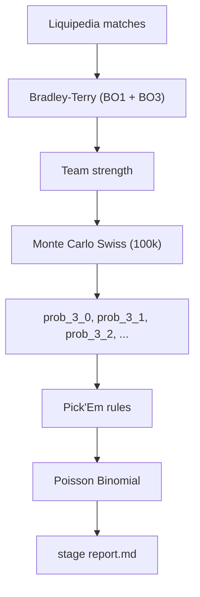
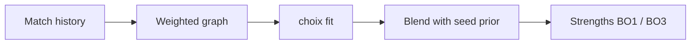
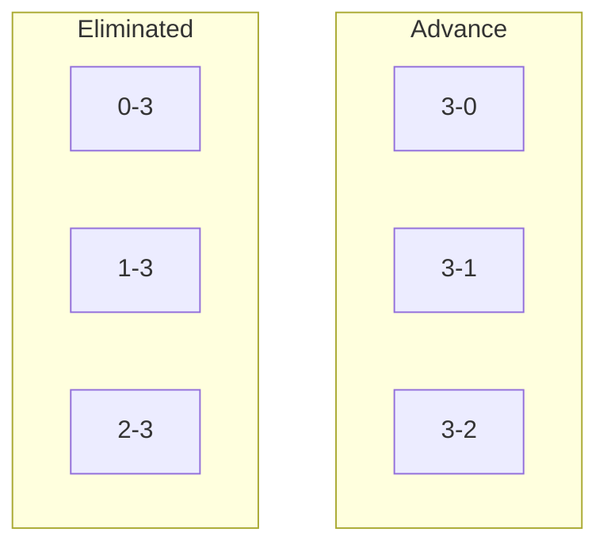

**English** | [Українська](MODEL.uk.md)

# Pick'Em Predictor — Mathematical Model

Short description of **what the system computes** and **how**.

---

## Overview

Strength parameters are fit from match history; the rest is simulation and combinatorics.

---

## 1. Bradley-Terry — team strength

Two separate models: **BO1** and **BO3**.

Each team $i$ has strength $s_i$. Probability that $A$ beats $B$:

$$
P(A \text{ beats } B) = \frac{s_A}{s_A + s_B}
$$

The model fits $\{s_i\}$ from all match results (via `choix`).

**Graph:** trained on **all** opponents in team files (MOUZ, tier-3, etc.). Strengths returned only for the 16 roster teams.

### Match weight

Recent games matter more (exponential decay):

$$
\text{weight} = 0.5^{\,\mathrm{ageDays}/30}
$$

- half-life = **30 days**
- cutoff = **180 days** (older → weight $\approx 0$, skip)

Roster vs roster (both teams in stage) → **×4** on weight.

### Seed prior

If a team has few matches vs roster opponents, strength is blended with a seed-based prior:

$$
\text{prior}_i = \exp\bigl(-0.15 \cdot (\text{seed}_i - 1)\bigr)
$$

$$
s_i^{\text{final}} = \lambda \cdot s_i^{\text{BT}} + (1 - \lambda) \cdot \text{prior}_i
$$

$$
\lambda = \min\left(1,\; \frac{\text{rosterMatches}_i}{8}\right)
$$

---

## 2. Monte Carlo Swiss

**N iterations** (default 100k). Each run simulates a full Swiss bracket:

| Rule  | Implementation                 |
| ----- | ------------------------------ |
| R1    | 1v9, 2v10, …, 8v16 by seed     |
| Later | Buchholz pairing, no rematches |
| BO1   | regular rounds                 |
| BO3   | deciders (2-2, 2-0)            |

After each sim — final record → bucket:

| Bucket        | Meaning    |
| ------------- | ---------- |
| 3-0, 3-1, 3-2 | advance    |
| 0-3, 1-3, 2-3 | eliminated |

Bucket probability = frequency over sims:

$$
P(3\text{-}1) \approx \frac{\text{count}(3\text{-}1)}{N}
$$

$$
P(\text{advance}) = P(3\text{-}0) + P(3\text{-}1) + P(3\text{-}2)
$$

`-i` / `--iterations` sets $N$ (e.g. `100k`, `200k`). Higher $N$ → lower noise; picks usually unchanged.

---

## 3. Pick'Em selection

Greedy rules on top of probabilities (not global optimization):

| Slot           | Rule                                              |
| -------------- | ------------------------------------------------- |
| **3-0 ×2**     | top-2 by $P(3\text{-}0)$                          |
| **Advance ×6** | top-6 by $P(\text{advance})$, no overlap with 3-0 |
| **0-3 ×2**     | top-2 by $P(0\text{-}3)$                          |

**Seed guard (0-3):** seed $\leq 8$ and $P(0\text{-}3) < 0.20$ → skip, take next team.

Advance = teams that qualify (3-1 or 3-2), no per-team path label.

---

## 4. Poisson Binomial

10 picks with different $p_i$. Chance of **≥ 5** correct:

$$
P(\geq 5) = \sum_{k=5}^{10} P(\text{exactly } k)
$$

Computed by DP in $O(n^2)$ — picks are independent with different probabilities (not ordinary binomial).

---

## What the model does / doesn't do

| ✓                                 | ✗                           |
| --------------------------------- | --------------------------- |
| Statistical rating from history   | Neural nets / ML pipeline   |
| Swiss bracket structure (seed R1) | Momentum, roster changes    |
| Recent form (30d decay)           | Global Pick'Em optimization |
| Marginal probabilities            | Specific bracket path       |

---

## One sentence

> **BT estimates strength → Monte Carlo simulates Swiss → rules select picks → Poisson Binomial computes P(≥5).**
