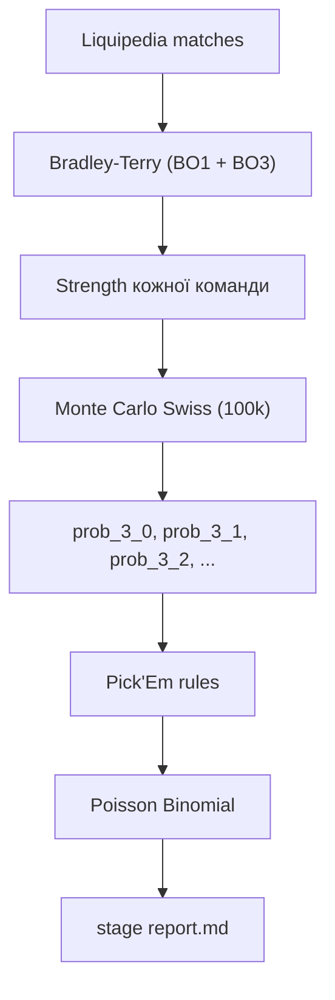
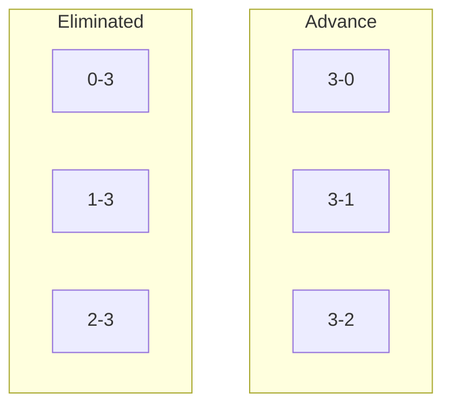

# Математична модель Pick'Em Predictor

Короткий опис того, **що саме рахує система** і **як**.

---

## Загальна схема

**Не ML.** Параметри сили підбираються з історії матчів; решта — симуляція і combinatorics.

---

## 1. Bradley-Terry — сила команд

Дві окремі моделі: **BO1** і **BO3**.

Кожна команда $i$ має strength $s_i$. Ймовірність перемоги $A$ над $B$:

$$
P(A \text{ beats } B) = \frac{s_A}{s_A + s_B}
$$

Модель підбирає $\{s_i\}$ з усіх результатів матчів (fit через `choix`).

**Граф:** тренуємо на **всіх** опонентах з team files (MOUZ, tier-3…). Strengths повертаємо лише для 16 roster-команд.

### Вага матчу

Свіжі ігри важать більше (exponential decay):

$$
\text{weight} = 0.5^{\,\text{age\_days}\,/\,30}
$$

- half-life = **30 днів**
- cutoff = **180 днів** (старіше → weight $\approx 0$, skip)

Roster vs roster (обидві команди в stage) → **×4** до weight.

### Seed prior

Якщо мало матчів проти roster-опонентів, strength змішується з prior за seed:

$$
\text{prior}_i = \exp\bigl(-0.15 \cdot (\text{seed}_i - 1)\bigr)
$$

$$
s_i^{\text{final}} = \lambda \cdot s_i^{\text{BT}} + (1 - \lambda) \cdot \text{prior}_i
$$

$$
\lambda = \min\left(1,\; \frac{\text{roster\_matches}_i}{8}\right)
$$

---

## 2. Monte Carlo Swiss

**N ітерацій** (default 100k). Кожна — повний Swiss bracket:

| Правило | Реалізація |
| --- | --- |
| R1 | 1v9, 2v10, …, 8v16 за seed |
| Далі | Buchholz pairing, без реваншів |
| BO1 | звичайні раунди |
| BO3 | вирішальні (2-2, 2-0) |

Після sim — фінальний record → bucket:

| Bucket | Значення |
| --- | --- |
| 3-0, 3-1, 3-2 | advance |
| 0-3, 1-3, 2-3 | eliminated |

Ймовірність bucket = частота по sim:

$$
P(3\text{-}1) \approx \frac{\text{count}(3\text{-}1)}{N}
$$

$$
P(\text{advance}) = P(3\text{-}0) + P(3\text{-}1) + P(3\text{-}2)
$$

Параметр `-i` / `--iterations` змінює $N$ (напр. `100k`, `200k`). Більше $N$ → менший шум, picks зазвичай ті самі.

---

## 3. Pick'Em selection

Greedy rules поверх ймовірностей (не глобальна оптимізація):

| Слот | Правило |
| --- | --- |
| **3-0 ×2** | top-2 по $P(3\text{-}0)$ |
| **Advance ×6** | top-6 по $P(\text{advance})$, без overlap з 3-0 |
| **0-3 ×2** | top-2 по $P(0\text{-}3)$ |

**Seed guard (0-3):** seed $\leq 8$ і $P(0\text{-}3) < 0.20$ → skip, беремо наступну.

Advance = «вийдуть» (3-1 або 3-2), без label біля кожної команди.

---

## 4. Poisson Binomial

10 picks з різними $p_i$. Шанс вгадати **≥ 5**:

$$
P(\geq 5) = \sum_{k=5}^{10} P(\text{exactly } k)
$$

Рахується DP за $O(n^2)$, бо picks незалежні з різними ймовірностями (не звичайний binomial).

---

## Що модель робить / не робить

| ✓ | ✗ |
| --- | --- |
| Статистичний рейтинг з історії | Neural nets / ML pipeline |
| Swiss bracket structure (seed R1) | Momentum, roster changes |
| Свіжа форма (decay 30d) | Глобальна оптимізація Pick'Em |
| Marginal probabilities | Конкретний path bracket |

---

## Одне речення

> **BT оцінює силу → Monte Carlo прогнозує Swiss → правила обирають picks → Poisson Binomial рахує шанс 5+/10.**
