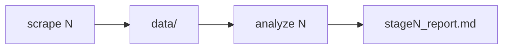
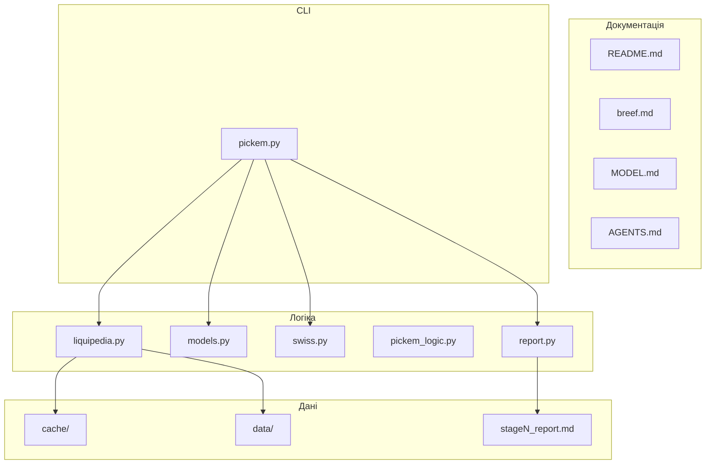

# CS2 Pick'Em Predictor

Статистичний предиктор для **Steam Pick'Em** на **IEM Cologne Major 2026**. Збирає матчі з Liquipedia, оцінює силу команд, симулює Swiss/Playoffs і генерує Markdown-репорт з ймовірностями та recommended picks.

---

## Для чого

- Підготувати **Pick'Em** перед Stage 1 / 2 / 3 або Playoffs
- Побачити **marginal probabilities** (3-0, 3-1, 3-2, 0-3…) для кожної команди
- Оцінити **шанс набрати ≥5/10** правильних picks (Poisson Binomial)
- Швидко перерахувати прогноз після `scrape` — без ручного збору stats

Турнір захардкодений: `Intel_Extreme_Masters/2026/Cologne` (`pickem.py` → `TOURNAMENT`).

---

## Звідки це взялось (бриф)

Оригінальна задача — [`breef.md`](breef.md). Коротко, що там було:

1. **Scrape** — roster стейджу + match history з Liquipedia (6 міс, кеш)
2. **Bradley-Terry** — окремо BO1 і BO3, strengths з історії матчів
3. **Monte Carlo Swiss** — 100k sim за правилами Valve
4. **Pick'Em** — top-2 3-0, top-6 advance, top-2 0-3 + `prob_at_least_5`
5. **Output** — `stage{N}_report.md`

Реалізація пішла далі брифу: exponential decay, roster weight ×4, seed prior, 6 Swiss-кошиків, seed guard для 0-3, two-phase CLI (`scrape` / `analyze`). Деталі — [`MODEL.md`](MODEL.md).

---

## Швидкий старт

```bash
uv sync
uv run python pickem.py scrape 1
uv run python pickem.py analyze 1
```

Результат: **`stage1_report.md`** у корені проєкту. Приклад репорту комітиться в repo — можна подивитись результат без `scrape`.

```bash
uv run python pickem.py analyze 1 -i 200k   # більше MC ітерацій
```

---

## Як користуватись

### Workflow



| Крок | Команда | HTTP | Результат |
| --- | --- | --- | --- |
| 1 | `scrape N` | Так* | `data/rosters/`, `data/teams/` |
| 2 | `analyze N` | **Ні** | `stage{N}_report.md` |

\* Default scrape читає `cache/` — 0 HTTP якщо сторінки вже качали.

**Коли що запускати:**

- **Перед стейджем** — `scrape` + `analyze`
- **Після нових ігор на major** — `scrape N --fresh`, потім `analyze`
- **Експерименти з MC** — лише `analyze` (офлайн, швидко)

### Scrape

```bash
uv run python pickem.py scrape 1      # Stage 1
uv run python pickem.py scrape 2      # Stage 2
uv run python pickem.py scrape 3      # Stage 3
uv run python pickem.py scrape 4      # Playoffs roster
uv run python pickem.py scrape 1 --fresh   # bypass cache, hit Liquipedia
```

| Флаг | Опис |
| --- | --- |
| `--fresh` | Ігнорувати `cache/`, заново тягнути з LP |
| `--quiet` | Менше логів |

Incremental merge: у `data/teams/` додаються лише **нові** матчі (dedupe pair+date).

### Analyze

```bash
uv run python pickem.py analyze 1
uv run python pickem.py analyze 1 -i 200k
uv run python pickem.py analyze 1 --iterations 200000
```

| Флаг | Опис |
| --- | --- |
| `-i`, `--iterations` | Monte Carlo: `100k` default, `200k` для меншого шуму |
| `--quiet` | Менше логів |

Потрібен готовий `data/` — спочатку `scrape`.

---

## Документація проєкту

| Файл | Що там |
| --- | --- |
| [`breef.md`](breef.md) | Оригінальний бриф задачі |
| [`MODEL.md`](MODEL.md) | Математична модель: BT, decay, MC Swiss, Pick'Em, формули (GitHub Math) |
| [`AGENTS.md`](AGENTS.md) | Архітектура для розробки / AI-агентів |
| `stage{N}_report.md` | Output — таблиця ймовірностей + recommended Pick'Em (комітиться як приклад) |

---

## Stage report — що всередині

Файл `stage1_report.md`, `stage2_report.md` … генерується в **корені проєкту** командою `analyze`. Комітиться в git, щоб можна було побачити результат без Liquipedia (без 429). Після нового `analyze` — оновлюй і коміть, якщо хочеш поділитись свіжим прогнозом.

**1. Таблиця ймовірностей** — 16 команд × 6 Swiss-кошиків:

| Колонка | Значення |
| --- | --- |
| 3-0, 3-1, 3-2 | вихід з різним record |
| Advance | 3-0 + 3-1 + 3-2 |
| 0-3, 1-3, 2-3 | виліт |

**2. Recommended Pick'Em:**

| Слот | Логіка |
| --- | --- |
| **3-0 ×2** | top-2 по P(3-0) |
| **Advance ×6** | top-6 по P(advance), без overlap з 3-0 |
| **0-3 ×2** | top-2 по P(0-3), seed guard (seed ≤8, prob < 20% → skip) |
| **prob_at_least_5** | Poisson Binomial для 10 picks |

---

## Структура проєкту



| Шлях | Опис |
| --- | --- |
| `pickem.py` | CLI: `scrape` / `analyze` |
| `liquipedia.py` | Liquipedia API, парсинг, disk cache |
| `models.py` | Bradley-Terry (BO1 + BO3) |
| `swiss.py` | Monte Carlo Swiss |
| `bracket.py` | Monte Carlo Playoffs (stage 4) |
| `pickem_logic.py` | Pick'Em rules + Poisson Binomial |
| `report.py` | Markdown-генератор |
| `cache/` | Raw API JSON (SHA256 keys), gitignored |
| `data/rosters/IEM_Cologne_2026/stage{N}.json` | 16 команд + seeds |
| `data/teams/{Team}.json` | Match history (incremental) |
| `stage{N}_report.md` | Output репорт (комітиться) |

---

## Модель (одним абзацом)

Bradley-Terry оцінює strength кожної команди з weighted match history → Monte Carlo прогоняє 100k Swiss brackets → правила обирають picks → Poisson Binomial рахує P(≥5).

Детально з формулами і Mermaid-схемами: **[`MODEL.md`](MODEL.md)**.

---

## Troubleshooting

| Проблема | Рішення |
| --- | --- |
| `Roster not found` | Спочатку `scrape N` |
| `Team data not found` | Scrape не завершився — перезапусти |
| HTTP 429 від LP | Не спам `--fresh`; default cache-on безпечніший |
| Старі матчі | `scrape N --fresh` після нових ігор |

---

## Вимоги

- Python **3.14+**
- [uv](https://docs.astral.sh/uv/)

```bash
uv sync
```

Стек: numpy, scipy, pandas, requests, choix, beautifulsoup4.

---

*Вибачте, [Liquipedia](https://liquipedia.net/counterstrike), що спамили ваш API і забирали дані. Обіцяємо, що `cache/` — це наш спосіб більше не турбувати.*
