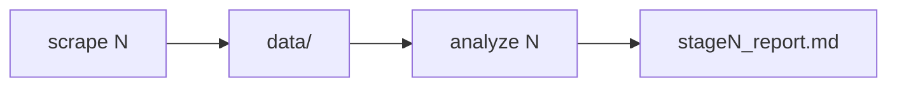
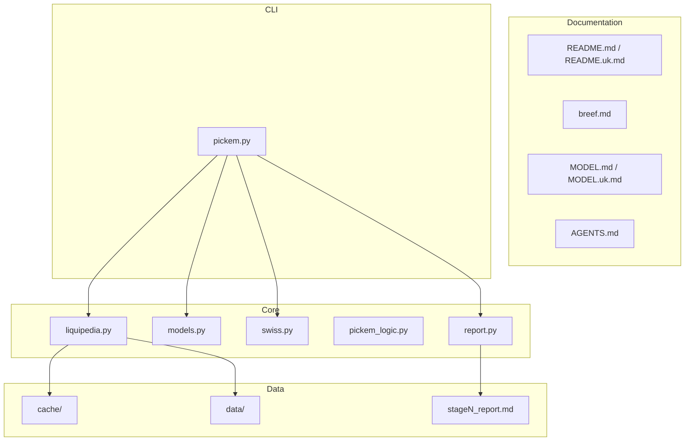

**English** | [Українська](README.uk.md)

# CS2 Pick'Em Predictor

Statistical predictor for **Steam Pick'Em** at **IEM Cologne Major 2026**. Fetches matches from Liquipedia, estimates team strength, simulates Swiss/Playoffs, and writes a Markdown report with probabilities and recommended picks.

---

## What it's for

- Prepare **Pick'Em** before Stage 1 / 2 / 3 or Playoffs
- See **marginal probabilities** (3-0, 3-1, 3-2, 0-3…) per team
- Estimate **chance of ≥5/10** correct picks (Poisson Binomial)
- Re-run forecasts after `scrape` without manual stat gathering

Tournament is hardcoded: `Intel_Extreme_Masters/2026/Cologne` (`pickem.py` → `TOURNAMENT`).

---

## Origin (brief)

Original task spec — [`breef.md`](breef.md) (Ukrainian only). Summary:

1. **Scrape** — stage roster + match history from Liquipedia (6 months, cache)
2. **Bradley-Terry** — separate BO1 and BO3, strengths from match history
3. **Monte Carlo Swiss** — 100k sims under Valve rules
4. **Pick'Em** — top-2 3-0, top-6 advance, top-2 0-3 + `prob_at_least_5`
5. **Output** — `stage{N}_report.md`

Implementation went beyond the brief: exponential decay, roster weight ×4, seed prior, 6 Swiss buckets, 0-3 seed guard, two-phase CLI (`scrape` / `analyze`). Details — [`MODEL.md`](MODEL.md).

---

## Quick start

```bash
uv sync
uv run python pickem.py scrape 1
uv run python pickem.py analyze 1
```

Output: **`stage1_report.md`** in the project root. Sample reports are committed so you can view results without running `scrape`.

```bash
uv run python pickem.py analyze 1 -i 200k   # more MC iterations
```

---

## Usage

### Workflow



| Step | Command | HTTP | Output |
| --- | --- | --- | --- |
| 1 | `scrape N` | Yes* | `data/rosters/`, `data/teams/` |
| 2 | `analyze N` | **No** | `stage{N}_report.md` |

\* Default scrape reads `cache/` — 0 HTTP if pages were fetched before.

**When to run what:**

- **Before a stage** — `scrape` + `analyze`
- **After new major games** — `scrape N --fresh`, then `analyze`
- **MC experiments** — `analyze` only (offline, fast)

### Scrape

```bash
uv run python pickem.py scrape 1      # Stage 1
uv run python pickem.py scrape 2      # Stage 2
uv run python pickem.py scrape 3      # Stage 3
uv run python pickem.py scrape 4      # Playoffs roster
uv run python pickem.py scrape 1 --fresh   # bypass cache, hit Liquipedia
```

| Flag | Description |
| --- | --- |
| `--fresh` | Ignore `cache/`, re-fetch from Liquipedia |
| `--quiet` | Less logging |

Incremental merge: `data/teams/` only gets **new** matches (dedupe by pair+date).

### Analyze

```bash
uv run python pickem.py analyze 1
uv run python pickem.py analyze 1 -i 200k
uv run python pickem.py analyze 1 --iterations 200000
```

| Flag | Description |
| --- | --- |
| `-i`, `--iterations` | Monte Carlo: `100k` default, `200k` for lower noise |
| `--quiet` | Less logging |

Requires `data/` from a prior `scrape`.

---

## Documentation

| File | Contents |
| --- | --- |
| [`breef.md`](breef.md) | Original task brief (UK) |
| [`MODEL.md`](MODEL.md) | Mathematical model (EN) |
| [`MODEL.uk.md`](MODEL.uk.md) | Математична модель (UK) |
| [`AGENTS.md`](AGENTS.md) | Architecture for development / AI agents |
| `stage{N}_report.md` | Output — probability table + recommended Pick'Em |

---

## Stage report

`stage1_report.md`, `stage2_report.md`, … are generated in the **project root** by `analyze`. Committed to git so results are visible without Liquipedia. Re-commit after a new `analyze` to share an updated forecast.

**1. Probability table** — 16 teams × 6 Swiss buckets:

| Column | Meaning |
| --- | --- |
| 3-0, 3-1, 3-2 | advance with that record |
| Advance | 3-0 + 3-1 + 3-2 |
| 0-3, 1-3, 2-3 | eliminated |

**2. Recommended Pick'Em:**

| Slot | Rule |
| --- | --- |
| **3-0 ×2** | top-2 by P(3-0) |
| **Advance ×6** | top-6 by P(advance), no overlap with 3-0 |
| **0-3 ×2** | top-2 by P(0-3), seed guard (seed ≤8, prob < 20% → skip) |
| **prob_at_least_5** | Poisson Binomial over 10 picks |

---

## Project structure



| Path | Description |
| --- | --- |
| `pickem.py` | CLI: `scrape` / `analyze` |
| `liquipedia.py` | Liquipedia API, parsing, disk cache |
| `models.py` | Bradley-Terry (BO1 + BO3) |
| `swiss.py` | Monte Carlo Swiss |
| `bracket.py` | Monte Carlo Playoffs (stage 4) |
| `pickem_logic.py` | Pick'Em rules + Poisson Binomial |
| `report.py` | Markdown report generator |
| `cache/` | Raw API JSON (SHA256 keys), gitignored |
| `data/rosters/IEM_Cologne_2026/stage{N}.json` | 16 teams + seeds |
| `data/teams/{Team}.json` | Match history (incremental) |
| `stage{N}_report.md` | Output report (committed) |

---

## Model (one paragraph)

Bradley-Terry estimates team strength from weighted match history → Monte Carlo runs 100k Swiss brackets → rules pick teams → Poisson Binomial computes P(≥5).

Full write-up with formulas: **[`MODEL.md`](MODEL.md)**.

---

## Troubleshooting

| Issue | Fix |
| --- | --- |
| `Roster not found` | Run `scrape N` first |
| `Team data not found` | Scrape failed — re-run |
| HTTP 429 from LP | Don't spam `--fresh`; default cache-on is safer |
| Stale matches | `scrape N --fresh` after new games |

---

## Requirements

- Python **3.14+**
- [uv](https://docs.astral.sh/uv/)

```bash
uv sync
```

Stack: numpy, scipy, pandas, requests, choix, beautifulsoup4.

---

*Sorry, [Liquipedia](https://liquipedia.net/counterstrike), for spamming your API and taking your data. We promise `cache/` is our way of bothering you less.*
